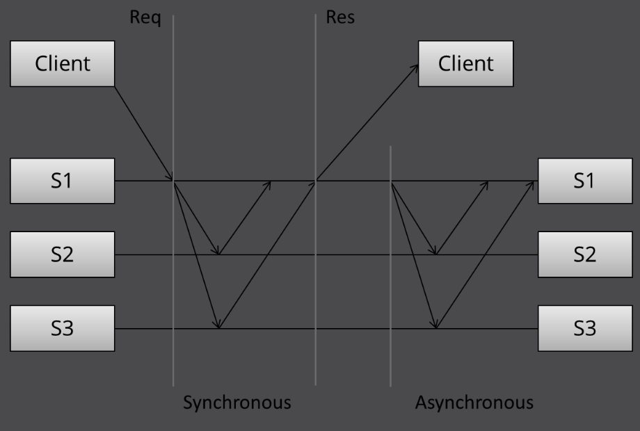
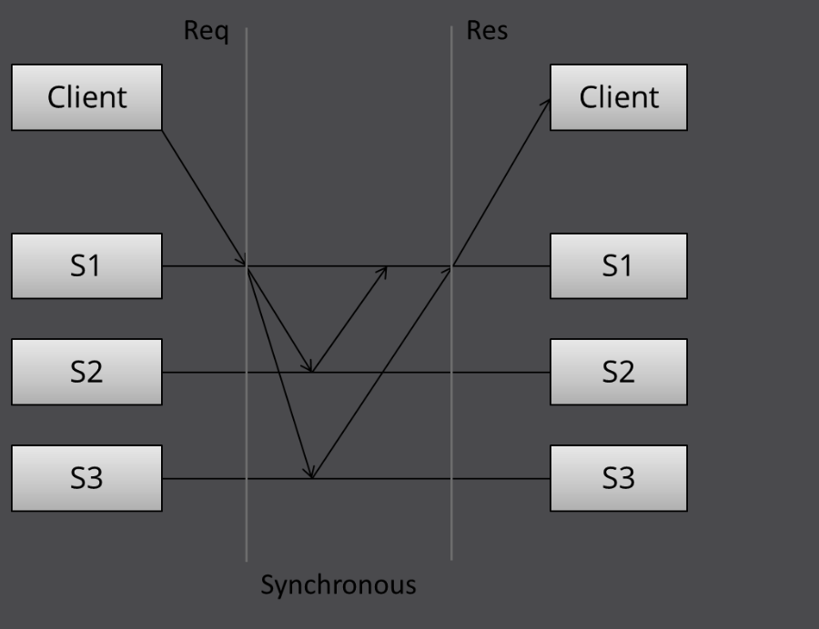
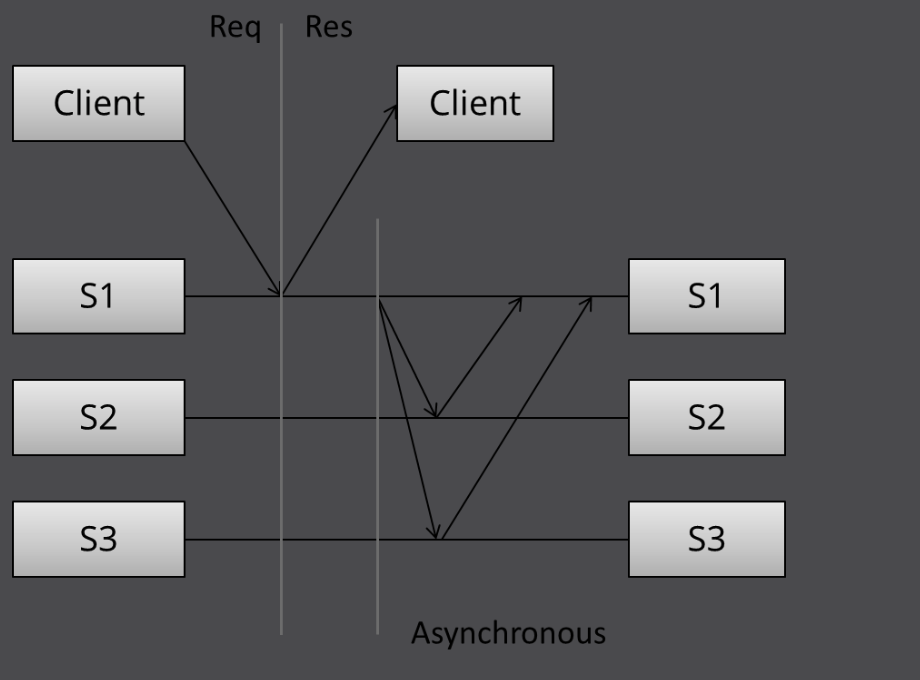
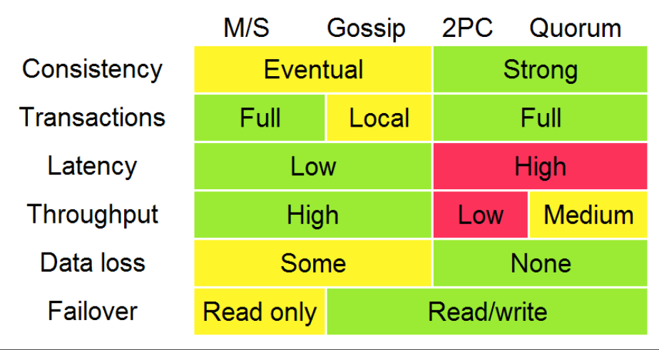

# 4. 复制

复制问题是分布式系统许多问题中的一个。我选择比其他问题比如领导选举，错误发现，互斥，一致性问题和全局快照更着重看待这个问题的原因是这通常是大部分人们最关系的问题。例如，判断并行数据库不同的一个依据就是它们复制功能的不同。并且，复制会带来了更多相关的子问题，例如领导选举，错误发现，一致性问题和原子广播。

复制是一组通讯问题。哪种组织和通信模式给我们带来了我们渴望的性能和可靠的性质？在面对网络隔离和同时多个节点故障的时候我们如何来确保容灾，持续运行和不产生不一致的情况呢？

再说一遍，现在有很多复制的方法。在这里我将会关注对一个系统的复制来说是高层级的模式。

组织和通讯模式可以被拆分成这一些阶段：

1. （请求）客户端发送请求给服务端
2. （同步）同步模块把副本落好位置
3. （响应）返回一个想要给客户端
4. （异步）异步模块把副本落好位置

这个模型是基于[这个文章](https://www.google.com/search?q=understanding+replication+in+databases+and+distributed+systems)的一个简易版。注意在每个模块消息传递模式是依赖于特定的算法：我会有意的避免去讨论这个特点的算法。

有了这些阶段，我们可以创建什么类型的通讯模式啦？已经哪个是我们要选择的能实现高性能和高可用的模式？

## 同步模式

第一个模式是同步模式（也可以被称为活跃的，或者热切的，或者推，或者悲观的复制）。让我们把样子画出来：

这里我们可以看到三个不同的阶段：首先是客户端发送请求，然后，同步模块把副本落好位置。在这同时客户端是被阻塞的 - 等待系统的一个响应。

在同步时期，第一个服务器接触到了另外两个服务器并且等待它收到了这些服务器的响应。最后，它发送一个响应给客户端通知结果（比如成功或者失败）。

所有的这一切看上去都是简洁明了的。那关于这种组织和通讯模式，除了讨论同步时期的算法细节之外我们还能说些什么呢？首先，我们看到这是一种写多对多的方法：在一个响应返回之前，它需要系统中所有的服务器看到并且认可。

从性能的角度来看，这意味着这个系统会由最慢速度的服务器来决定它的速度。系统会对网络延迟问题变得很敏感，因为它需要所有的服务器都返回后才能运行。

在这种多对多的方法中，系统都不能容忍有任何服务器断开。当一个服务器断开的时候，系统就不能再写成功到所有的节点了，也就不能再继续接下来的处理了。在这种设计中，在一个节点单机后，它可能还可以提供对数据的只读，但是不允许对数据进行修改。

这种组织模式可以提供很强的持久性保证：在响应被返回时客户端可以确定所有的N个服务都接收到了，存入了数据并且认可了这个请求。为了能丢失一个接受到的更新，所有N个副本都需要丢失这个更新，这大概是你能做到的最好的对数据的保障吧。

## 异步复制

让我们和第二种模式 - 异步复制（也称作被动复制，或者拉复制，挥着懒复制）进行比较。正如你猜测的，这与同步复制相反。

这里，控制者（或者领导或者协调者）会立刻返回一个响应给客户端。它可能在本地已经保存好更新，但是它没有做一些有意义的工作在同步上并且客户端也不需要强制等待多轮不同服务器之间的通讯。

这后面的阶段，异步部分的复制任务把数据落好盘。这里控制者使用一些其他通讯模式联系其他的服务器，这些其他服务器会更新它们复制过来的数据。这依赖使用中的算法。

如果处理算法的细节我们还可以说这个设计的其他东西呢？是的，这是一个1对N的方法：一个响应会立刻返回，更新的传播会在之后发生。

从性能的角度来看，这个系统是快的：客户端不需要花额外的时间来等待系统内部的工作就可以去做它自己的工作了。系统在网络延迟上也更有容忍性，因为系统内部的延迟抖动不会对客户端产生额外的等待时间。

这种设计只能提供弱的，或者说有概率的持久性保证。如果没有什么事发生错误的话，数据最终都会复制到所有N台机器上的。但是，如果只包含数据的那台服务器在数据落盘之前丢失数据的话，这数据就会永久的丢失了。

这是一个1对N的方法，只要有一个节点运行着系统就可用（至少在理论上是的，但是在实践中这个节点的负载就会变得很高）。一个简洁的懒惰的方法就像这样提供一个没发持久性和一致性保证；你可以被允许去写系统，但是当错误发生时候不能保证你可以读回你写下的数据。

最终，这种被动的复制不能确定所有一下总是能包含相同的状态而变得毫无价值。如果你接受写到多个位置而不要求获得这些同步确认，你会出现数据分歧的风险：从不同位置读到的数据可能不一样（特别是在节点失败或者刚恢复的时候），也不能施加全局性的限制（这需要每个节点之间都联通）

我还没提到在读期间的通讯部分（而不是在写期间），因为读部分确实是跟随着写的部分：在读期间，有想要联系到尽可能少的节点。我们会在投票机制那里讨论更多的内容。

我们仅仅讨论了两种基本的方式也没有设计到具体的算法。同时我们也分析了一些关于可能的通讯模式以及它们的性能，持久性保证和高可用性。

## 总结一下主要的复制方式

已经讨论了两种基本复制方式同步和异步复制，让我们来看看主要的复制算法。

有很多不同的方法来对复制技术进行分类。我将会介绍的第二个区别（同步vs异步之后）是：

- 保护数据不分散（单独拷贝系统）的复制方式和
- 存在数据分散（多控制住系统）的复制方式

第一组方式的系统有一个特性就是它们可以“运行的像一个单独的系统”。特别的，单复制失败发生时，系统会确保在系统中只有一份拷贝是可用的。更进一步说，系统确保那些副本都是一致的。这就是所知的一致性问题。

一些进程（或者机器）如果它们都同意相同的数值就达到一致性。更详细的：

1. 同意：所有正确的进程一定要同意相同的数据。
2. 诚实：所以正确的进程至少要决定一个数值，并且如果决定了一些数值，那么必须被其他进程推荐。
3. 终止：所有进程最终都达成一个决定。
4. 有效：所有正确的进程提出相同的值V，然后所有正确的进程都决定这个V。

互斥，领导选举，多播和原子广播时所有一致性实例的普通问题。有副本的系统维护单副本复制一致性需要通过某些方法解决这些一致性问题。

维护单副本一直性的复制算有包括：

- 1层消息（异步 主/备）
- 2层消息（同步 主/备）
- 4层消息（2-阶段提交，多级-Paxos)
- 6层消息（3-阶段提交，Paxos和重复领导选举）

这些算法在它们的错误容忍性方面（例如它们可以容忍的错误的类型）有很大的差异。我来通过在执行期间消息传递的不同来对这些算法做一个简单的分类，因为我认为发掘这个问题“在增加消息传递我们能获得什么“的答案是有趣的。

下面的图表，改编自Ryan Barret[谷歌](https://www.google.com/events/io/2009/sessions/TransactionsAcrossDatacenters.html)，描述到了不同选项的一些方面：

在上面的图表上的一致性，延迟，吞吐量，数据丢失和故障转移这些特性都可以准确的追溯回到这两种不同的复制方式：同步复制（例如等待响应）和一步方式。当你等待响应，你获得更差的性能但是有更强的保证。在2PC和选举系统之间吞吐量的不同会在我们讨论分区（延迟）容忍性时变得很明显。

在这个图表上，执行的是弱一致性（最终一致性）的算法被分为一个类目（"gossip"）。但是我会跳轮复制方法的弱一致性 - goosip和

## 深入阅读

### Primary-backup and 2PC

- [Replication techniques for availablity](http://scholar.google.com/scholar?q=Replication+techniques+for+availability) - Robbert van Renesse & Rachid Guerraoui, 2010
- [Concurrency Control and Recovery in Database Systems](http://research.microsoft.com/en-us/people/philbe/ccontrol.aspx)

### Paxos

- [The Part-Time Parliament](http://research.microsoft.com/users/lamport/pubs/lamport-paxos.pdf) - Leslie Lamport
- [Paxos Made Simple](http://research.microsoft.com/users/lamport/pubs/paxos-simple.pdf) - Leslie Lamport, 2001
- [Paxos Made Live - An Engineering Perspective](http://research.google.com/archive/paxos_made_live.html) - Chandra et al
- [Paxos Made Practical](http://scholar.google.com/scholar?q=Paxos+Made+Practical) - Mazieres, 2007
- [Revisiting the Paxos Algorithm](http://scholar.google.com/scholar?q=Paxos+Made+Practical) - Lynch et al
- [How to build a highly available system with consensus](http://research.microsoft.com/lampson/58-Consensus/Acrobat.pdf) - Butler Lampson
- [Reconfiguring a State Machine](http://research.microsoft.com/en-us/um/people/lamport/pubs/reconfiguration-tutorial.pdf) - Lamport et al - changing cluster membership
- [Implementing Fault-Tolerant Services Using the State Machine Approach a Tutorial](http://citeseer.ist.psu.edu/viewdoc/summary?doi=10.1.1.20.4762) - Fred Schneider

### Raft and ZAB

- [In Search of an Understandable Consensus Algorithm](https://ramcloud.stanford.edu/wiki/download/attachments/11370504/raft.pdf), Diego Ongaro, John Ousterhout, 2013
- [Raft Lecture - User Study](http://www.youtube.com/watch?v=YbZ3zDzDnrw)
- [A simple totally ordered broadcast protocol](http://research.yahoo.com/pub/3274) - Junqueira, Reed
- [Zookeeper Atomic Broadcast](http://research.yahoo.com/pub/3514)